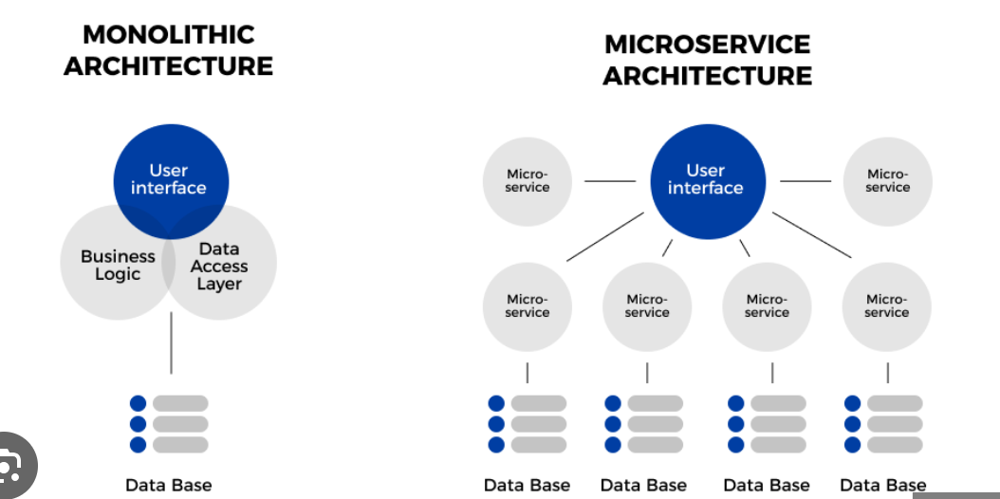

= Mitschrift SEW - 2025/26
:icons: font
:toc:
:sectnums:

== 2025-09-10 Quarkus Einstieg und Wiederholung

* Was ist Maven?
** Maven ladet automatisch Abhängigkeiten in usr/home/m2 herunter .
* Was ist ein Rest Service?
** Internet für Menschen, bzw. für Maschinen lesbarer Text.
* Kubernetes
** Orchestrierungstool, ähnlich wie Docker-Compose.
* Was ist Quarkus?
** Quarkus ist ein Backend-Framework für Java, welches REST-APIs und weitere Services bereitstellt. Diese APIs können vom Frontend angesprochen werden.

== 2025-09-15

=== Konzepte
==== Internet für Menschen / Personen
* Webseiten mit html/js/css

==== Internet für Maschinen und Prozesse (verteilte Systeme)
* SOAP...Simple Object Access Protocol
** hat sich nicht gut bewertet weil es XML-basiert ist und somit schwergewichtigt ist.
* Rest
** Man braucht Endpunkte (Endpoints), von wo man sich mithilfe von GET-Request Daten holt.
** Rest ist starr in seiner Struktur.
* graphQL
** Weiterentwicklung von REST mit flexiblerer Möglichkeit Daten zu holen.
* gRPC...google Remote Procedure Call
** Ermöglicht es einem Client, eine Funktion oder Methode auf einem entfernten Server aufzurufen
* SSE
* MQTT

==== REST
* Representational State Transfer
* HTTP Methoden
* Übertragung beliebiger Text-(HTML,XML,JSON,...) und Binärformate(Images,PDF,...)

IMPORTANT: proprietär...firmenspezifisch(nicht offengelegt, nicht standartisiert,nicht interoperabel)

==== graphQL
* von Facebook entwickelt
* Abfragesprache für APIs
* flexible Abfragen
* nur eine einzige Endpoint URL
* gut geeignet für komplexe Datenstrukturen
* weniger Overhead als REST
* stark typisiert

==== gRPC

* von Google entwickelt
* Remote Procedure Call (RPC) Framework
* basiert auf HTTP/2
* unterstützt mehrere Programmiersprachen
* gut geeignet für Microservice
* effizient und schmall
* stark typisiert
* unterstützt Streaming
* benötigt Protokollpuffe (Protocol Buffers) zur Definition der Schnittstellen

==== Websockets
* bidirertionale Kommunikation
* Echtzeit Anwendungen
* text- und binäre Daten

==== SSE (Server-Sent-Events)
* unidirektionale Kommunikation (Server zu Client)
* Echtzeit-Updates
* textbasierte Daten(meist JSON)
* einfach zu implementieren
* gut geeigent für Benachrichtigungen, Newsfeeds

==== MQTT (Message Queuing Telemetry Transport)
* leichtigewichtiges Publish-Subscribe-Protokoll
* für IoT entwickelt
* funktioniert über TCP/IP
* geringer Overhead
* gut geeignet für ressourcenbeschränkte Geräte
* unterstützt QoS Level

=== Allgemeine Begriffe
* Designpattern
** Entwurfsmuster für immerwiederkehrende Probleme

|===
|Observer pattern |Publish Subscribe

|Direkt gekoppelt → Observer registriert sich beim Subject.
|Lose gekoppelt → Publisher und Subscriber kommunizieren über einen

|Broker/Event-Bus.
|Publisher kennt Subscriber nicht.
|===

==== Anforderungen
* Werden gefordert

== 2025-09-16
=== Keycloak
* ist ein Login-System, ein Authotefizierungsserver , welches dem Programmierer viel Arbeit sparrt.

== 2025-09-22
=== Prüfungsfragen
* Was ist REST?
* Welche REST-Anforderungen gibt es?
* Was ist HTML?
* Was ist HTTP?

== 2025-10-06

=== Prüfungsfragen – Zusammenfassung

==== Was ist proprietär?
Proprietär bedeutet *firmenspezifisch* oder *nicht standardisiert*.
Eine proprietäre Software oder Technologie gehört einem bestimmten Unternehmen, das die Kontrolle über deren Nutzung, Änderung und Weitergabe behält.
Beispiel: Microsoft Word ist proprietär, während LibreOffice Open Source ist.

==== Was ist ein Handshake?
Ein *Handshake* ist ein Kommunikationsprozess zwischen zwei Systemen (z. B. Client und Server oder Browser und Server),
bei dem sie sich gegenseitig über Verbindungsparameter, Verschlüsselung oder Authentifizierung einigen.
Beispiel: Beim Aufbau einer HTTPS-Verbindung erfolgt ein TLS-Handshake.

==== Unterschied Microservice vs. Monolith
* *Monolith*: Eine Anwendung besteht aus einem großen Block mit allen Funktionen und Modulen gemeinsam.
Änderungen sind oft schwierig und erfordern ein erneutes Deployment der gesamten Anwendung.
* *Microservices*: Die Anwendung ist in *mehrere kleine, unabhängige Services* aufgeteilt.
Jeder Service kann separat entwickelt, getestet, deployed und skaliert werden.

==== GraphQL vs. REST
* *REST*:
- Nutzt mehrere Endpunkte (z. B. `/users`, `/products`).
- Server bestimmt, welche Daten zurückgegeben werden.
- Kann zu *Overfetching* oder *Underfetching* führen.
* *GraphQL*:
- Nur *ein einziger Endpunkt*.
- Client bestimmt selbst, *welche Daten* er benötigt.
- Spart Bandbreite und reduziert unnötige Datenübertragung.

==== Was ist referenzielle Integrität?
Die *referenzielle Integrität* stellt sicher, dass Beziehungen zwischen Tabellen in einer Datenbank konsistent bleiben.
Wenn ein Fremdschlüssel in einer Tabelle auf eine andere Tabelle verweist, darf der referenzierte Datensatz nicht gelöscht oder verändert werden,
ohne die Beziehung anzupassen.
Beispiel: Ein Schüler-Datensatz darf nicht existieren, wenn seine Schule gelöscht wurde.

==== Master-Detail-Tabellenbeziehung
Eine *Master-Detail-Beziehung* (auch 1:n-Beziehung) beschreibt, dass:
- eine *Master-Tabelle* (z. B. *Kunde*) mehrere *Detail-Datensätze* (z. B. *Bestellungen*) haben kann.
- Die Detail-Tabelle enthält einen *Fremdschlüssel* zur Master-Tabelle.

==== Orphaned Record
Ein *Orphaned Record* (verwaister Datensatz) ist ein Datensatz, der *keine Verbindung mehr zu seinem übergeordneten Datensatz* hat.
Das passiert z. B., wenn ein übergeordneter Datensatz gelöscht wird, aber abhängige Datensätze bestehen bleiben.
Dies führt zu Dateninkonsistenz und sollte durch referenzielle Integrität verhindert werden.

==== Restrict vs. Cascading Delete vs. Nullify
* *Restrict*: Das Löschen eines übergeordneten Datensatzes wird *verhindert*, wenn abhängige Datensätze existieren.
* **Cascading Delete**: Beim Löschen eines übergeordneten Datensatzes werden *alle abhängigen Datensätze automatisch mitgelöscht*.
* *Nullify*: Beim Löschen des übergeordneten Datensatzes wird der *Fremdschlüssel in den abhängigen Datensätzen auf NULL gesetzt*.

==== Was ist JACKSON?
*Jackson* ist eine Java-Bibliothek zum *(De-)Serialisieren von JSON-Daten*.
Sie wandelt JSON in Java-Objekte um und umgekehrt.
Dieser Prozess wird auch *Marshalling (Serialisierung)* und *Unmarshalling (Deserialisierung)* genannt.

==== Was ist JAX-RS?
*JAX-RS* (Java API for RESTful Web Services) ist eine *Java-Spezifikation* zur Erstellung von REST-APIs.
Sie verwendet Annotationen wie `@GET`, `@POST`, `@Path`, `@Produces`, um HTTP-Endpunkte einfach zu definieren.

==== Was ist ein Singleton?
Das *Singleton-Pattern* stellt sicher, dass von einer Klasse *nur eine Instanz* existiert.
Diese Instanz ist global zugänglich.
Typisches Beispiel: Eine zentrale *Logger*- oder *Konfigurationsklasse*.

==== Convention over Configuration
Ein Software-Prinzip, das besagt:
> „Wenn du dich an die Konventionen hältst, musst du nichts konfigurieren.“

Das bedeutet, dass Frameworks *Standardverhalten automatisch übernehmen*, solange der Entwickler sich an gewisse Namens- oder Strukturkonventionen hält.
Beispiel: In Spring Boot wird `application.properties` automatisch erkannt.

==== Was ist ein Paradigma?
Ein *Paradigma* ist ein grundlegendes *Denk- oder Programmierkonzept*, das vorgibt, wie Software strukturiert und entwickelt wird.
Beispiele:
- *Objektorientiert* (Java, C++)
- *Funktional* (Haskell, JavaScript)
- *Prozedural* (C)

==== Was ist eine Objektidentität?
Die *Objektidentität* beschreibt die eindeutige Existenz eines Objekts im Speicher.
Zwei Objekte können *denselben Inhalt* haben, aber *verschiedene Identitäten* besitzen.
In Java wird die Identität durch den *Speicherort (Referenz)* bestimmt.
Beispiel:

[source,java]
----
Person p1 = new Person("John");
Person p2 = new Person("John");
----
p1.equals(p2) kann true sein (gleicher Inhalt),
aber p1 == p2 ist false (unterschiedliche Identität).

